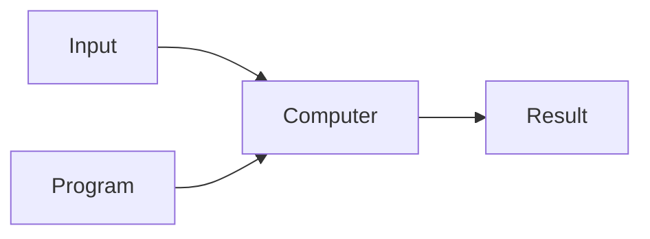
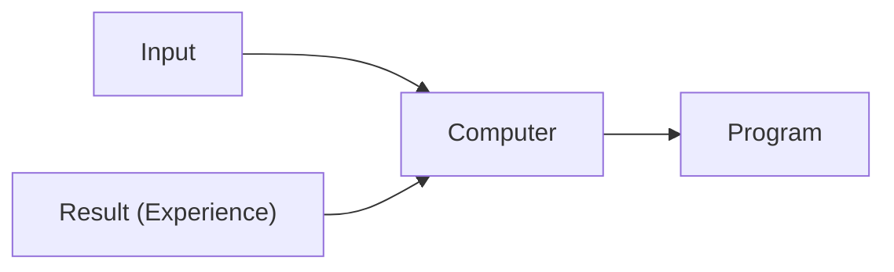

# Machine Learning
#wiki #cs4375 

A field that is concerned with how to construct computer programs that automatically improve with experience.

Formally,
 
> "A computer program is said to learn from experience *E* with respect to some class of tasks *T* and performance measure *P*, if its performance at tasks in *T*, as measured by *P*, improves with experience *E*."

## Regular programs vs. ML

**Regular Programs**

**Machine Learning**

## Applications
- Spam detection, spam detection
- Web search
- Credit card fraud
- Stock prediction

## Types
Machine learning solves problems that fall into three buckets: **supervised learning**, **unsupervised learning**, and **reinforcement learning**.

| Supervised                 | Unsupervised                  | Reinforcement                   |
| -------------------------- | ----------------------------- | ------------------------------- |
| Labeled data               | Unlabeled data                | Decision process                |
| Direct feedback            | No feedback                   | Reward signal                   |
| Predict output given input | Find hidden structure in data | Learn actions in an environment |

Each of these are detailed in [[Types of Machine Learning]].

## Example
**Recognizing Handwritten Digits**
- Task (T): Recognizing and classifying digits within image
- Performance measure (P): Percent of images correctly classified
- Training experience (E): Dataset of digits given classifications [training set]
    - 16x16 bitmaps, 8-bit grayscale
- In this case, Training Set + Test Set ⇒ Computer ⇒ Program
- How do we find the similarity between two images?
    - Euclidean distance: $d(\mathbf{p}, \mathbf{q}) = \sqrt{(p_1 - q_1)^2 + (p_2 - q_2)^2 + \dots + (p_n - q_n)^2}$
    - Similarity: $\frac{1}{1+d}$
- Find the *k*-closest images based on the similarity
