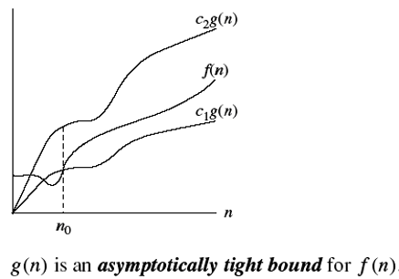
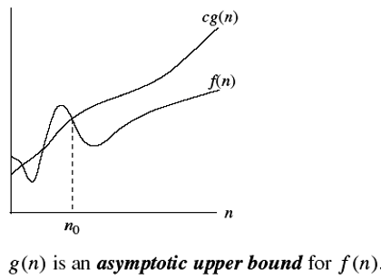

# Asymptotic Efficiency
#wiki #cs4349 

A method for analyzing the runtime of [[algorithms]]. Instead of focusing on the running time (which can vary from computer to computer), we focus on the growth of the running time as the input increases without bound.

## Expressing Efficiency
### Theta Notation
$\Theta(g (n))$ is the set of functions such that there is some $f(n)$ and positive constants $c_1$, $c_2$, and $n_0$ that satisfy $0 \leq c_1 g(n) \leq f(n) \leq c_2 g(n)$ for all $n \geq n_0$. When saying that $f(n) = \Theta(g(n))$, you're saying $f(n)$ belongs to the _set_ $\Theta(g(n))$.

This is also called an *asymptotically tight bound* for $f(n)$. In essence, what this means is that $f(n)$ is bound to within constant multiples of a function $g(n)$.

### Big-O Notation
$O(g (n))$ is the set of functions such that there is some $f(n)$ and positive constants $c$ and $n_0$ that satisfy $0 \leq f(n) \leq c g(n)$ for all $n \geq n_0$.

This is also called an *asymptotic upper bound* for $f(n)$. Big-O is useful for describing the *worst-case running time* of a function.

> **Note:** $f(n) = \Theta(g(n)) \implies f(n) = O(g(n))$ but not necessarily the other way around.

### Big-Omega Notation
$\Omega(g (n))$ is the set of functions such that there is some $f(n)$ and positive constants $c$ and $n_0$ that satisfy $0 \leq c g(n) \leq f(n)$ for all $n \geq n_0$.

This is also called an *asymptotic upper bound* for $f(n)$. Big-Omega is useful for describing the *best-case running time* of a function.

> **Note:** $f(n) = \Theta(g(n)) \implies f(n) = \Omega(g(n))$ but not necessarily the other way around.

> **Theorem**: $f(n) = \Theta(g(n)) \Longleftrightarrow f(n) = O(g(n)) \text{ and } f(n) = \Omega(g(n))$.

### Little-O Notation
The usecase for little-O is that we may have a upper bound that is *not asymptotically tight*, meaning it doesn't include the constant multiple of the function itself.

As such, $o(g (n))$ is the set of functions such that there is some $f(n)$ and positive constants $c$ and $n_0$ that satisfy $0 \leq f(n) < c g(n)$ for all $n \geq n_0$.

### Little-Omega Notation
The counterpart to little-o notation. It represents a lower bound that is *not asymptotically tight*.

$\omega(g(n))$ is the set of functions such that there is some $f(n)$ and positive constants $c$ and $n_0$ that satisfy $0 \leq c g(n) < f(n)$ for all $n \geq n_0$.

[//begin]: # "Autogenerated link references for markdown compatibility"
[algorithms]: algorithms.md "Algorithms"
[//end]: # "Autogenerated link references"