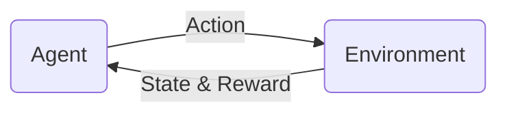

# Types of Machine Learning
#wiki #cs4375 

Problems solved by [[machine-learning]] fall into a few different buckets.

## Supervised learning
- Given a labeled training set, a learning algorithm can learn a model to predict labels of unlabeled data points
- These unlabeled data points could be test data (which we withhold the labels for in order to test the model's performance) or could be unlabeled data that we collect in the future.

### Classification
- Classification is a supervised learning task where we predict categorical class labels of new data points based on past observations
- Examples: classifying emails as spam/not spam, classifying handwritten digits

## Unsupervised learning
- Given an unlabeled training set, an algorithm learns the underlying structures of the data points
- One common task under this domain is clustering

## Reinforcement learning
- Reinforcement = the process of learning from rewards while performing a series of actions
- We do not provide the learner/agent with an action to take
    - We just provide a reward to each action and/or the overall outcome
- The learner must discover a behavior that maximizes the reward for a series of actions

[//begin]: # "Autogenerated link references for markdown compatibility"
[machine-learning]: machine-learning.md "Machine Learning"
[//end]: # "Autogenerated link references"