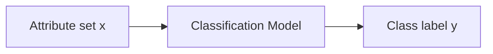

# Chapter 3
#lecture #cs4375 

**Classification**

# Classification
A machine learning model where each attribute set $x$ to some predefined class label $y$.

Note that $x$ must be a set of continuous or discrete features, while the $y$ must be discrete. If $y$ is continuous, the task is called **regression**.

## Descriptive Modeling vs. Predictive Modeling
A classification model can serve as 